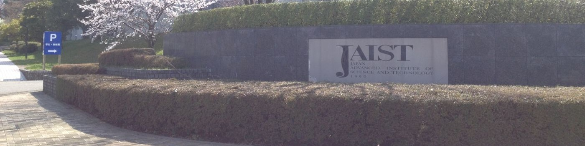

---
# Feel free to add content and custom Front Matter to this file.
# To modify the layout, see https://jekyllrb.com/docs/themes/#overriding-theme-defaults

layout: home
---

Hi, I'm **Hong**! 👋 I'm passionate about applying state-of-the-art Machine Learning methods and Big Data Advanced Analytics to solve challenging problems related to Healthcare & Life Science.
My research focuses on drug discovery, single-cell analysis, machine Learning in bioinformatics, and genomic data analysis. I am passionate about using computational methods to understand complex biological systems and contribute to advancements in health and medicine.

## Connect with Me
- [Email](mailto:ongxuanhong@gmail.com): Shoot me an email.
- [Scholar](https://scholar.google.com/citations?user=hvjCul4AAAAJ&hl=en): Check out my Google Scholar profile.
- [CV](docs/HongOng_CurriculumVitae.pdf): Download my CV.
- [Facebook](https://www.facebook.com/ong.x.hong): Follow me on Facebook.
- [Personal Blog](https://medium.com/@ongxuanhong): Check out my blog.

## About Me
- **An engineer** who love developing new technologies.
- **A scientist** who always eager to learn and discuss innovative ideas.
- **A team player** who's looking to collaborate on exciting projects.
- **Currently learning** Bioinformatics. 

## Research Interests
- **Drug Discovery:** Computational approaches to identify and optimize potential drug candidates.
- **Machine Learning in Bioinformatics:** Applying machine learning techniques to solve biological problems. 
- **Genomic Data Analysis:** Leveraging computational tools to analyze high-throughput sequencing data.

## Education
**Jan 2014 ~ Dec 2015**
- Master of Information Science, Japan Advanced Institute of Science and Technology
- Thesis advisor : Professor Nguyen Le Minh

**Sep 2008 ~ Dec 2012**
- Bachelor of Computer Science, University of Science, Vietnam National University

## Publications

**2025**
- **AI-driven Deep Learning Approach for Pan-Cancer Immune Profiling**, *MEDINFO 2025*
- **Convolutional neural network-based artificial intelligence for immune subtype classification in pan-cancer**, *AACR 2025*
- **C2GMatch: Leveraging Dual-View Cross-Guidance and Co-Guidance Framework for Semi-Supervised Cell Segmentation**, *2025 IEEE 6th International Conference on Image Processing, Applications and Systems (IPAS)*. [DOI](https://doi.org/10.1109/IPAS63548.2025.10924518)

**2022**
- **Ensemble learning using traditional machine learning and deep neural network for diagnosis of Alzheimer’s disease**, *IBRO Neuroscience Reports*. [DOI](https://doi.org/10.1016/j.ibneur.2022.08.010)
- **A Machine Learning Framework Based on Extreme Gradient Boosting for Intelligent Alzheimer’s Disease Diagnosis Using Structure MRI**, *8th International Conference on the Development of Biomedical Engineering*. [DOI](https://doi.org/10.1007/978-3-030-75506-5_66)

**2016**
- **Reranking CCG parser for Jazz chord sequences**, *Eighth International Conference on Knowledge and Systems Engineering*. [DOI](https://doi.org/10.1109/KSE.2016.7758054)

## My Projects
- [Yolov10 Working safety monitoring](https://github.com/ongxuanhong/yolov10-working-safety-monitoring)
- [RAG: QA with PDF files](https://github.com/ongxuanhong/rag-qa-with-pdf-files)
- [Spam text classification](https://github.com/ongxuanhong/spam-text-classification)
- [Image retrieval](https://github.com/ongxuanhong/image-retrieval)
- [Depth image estimation](https://github.com/ongxuanhong/depth-image-estimation)
- [Sentiment analysis on IMDB dataset](https://github.com/ongxuanhong/nlp-sentiment-analysis-on-imdb-dataset)
- [Heart disease prediction with ensemble learning](https://github.com/ongxuanhong/heart-disease-prediction-with-ensemble-learning)

## Industrial experiences
**EPAM Vietnam**

*Lead Machine Learning Engineer (Nov 2022 - Now)*
- Taking care of organizational units by leading people towards, and enabling effective achievement of business goals.
- Applying new technologies, and optimizing MLOps practices to deliver production-quality of Machine Learning Models in an efficient way on cloud data platform (Azure, AWS, GCP) also on-premise.
- Responsible for standardized unit tests, develop CI/CD pipelines, scripts to automate MLOps pipelines and APIs deployment,
- Big Data computation optimization, experiment tracking, data drift, and model drift detection.
- Major and interests research: Natural language processing, Computer Vision and Data mining.
- Key business domain: Healthcare & Life science, Digital marketing, Fin-tech, Digital transformation.

**HSV Group**

*Senior Machine Learning Engineer (Nov 2021 - Nov 2022)*
- Building and leading Data Science team for the fast-growing business.
- Built data pipelines to ingest data from multiple sources (ERP, CRM, Ecommerce, Flat files) to the Data platform and Data warehouse.
- Responsible for collecting data (POS stores, marketplace, ecommerce), putting it into the Data warehouse, preparing master data for references, ABC products analytics, and building forecasting models for the next 2 months.
- Developed Flask API for system integration with partners.
- Communicated with non-tech departments to align language across the team: On self-availability, Stock cover month, safety
stock, lead time, risk management, evaluation metrics RMAPE, manage expectations, and deliver high-quality data products.

**Pizza 4Ps**

*Senior Machine Learning Engineer (April 2021 - Nov 2021)*
- Develop recommender system APIs (Flask, PostgreSQL, Redis, Spark, GCS).
- Develop and maintain data platform from multiple SaaS (Salesforce, Tablecheck, SAP, etc).
- Conduct data analyst for sales forecasting, reservation, and association rules mining.
- Working on BI visualization tools (Google data studio, Redash, Metabase, etc).
- Cloud services: GCP, Azure, AWS.

**Trusting Social**

*Data Scientist (Sep 2017 – Feb 2021)*
- Developed feature engineering for credit scoring using Apache Spark.
- Tuned machine learning models.
- Optimized computation on Spark clusters.
- Developed data pipelines for calculating and combining features.
- Crawled additional data to enrich predictive models.
- Training Research Engineers members.

**Knorex**

*Data Engineer (Mar 2016 – Aug 2017)*
- Developed dashboard reports for analyzing impressions, clickthrough rate, and conversion rate of advertising campaigns.
- Ingested stream data to track page views and click events.
- Developed APIs for data management.

## Honors and Awards

**Speaker - We are community**

*EPAM (May 2023 - Now)*
- Maximizing Data Operations and Collaboration using the Feast Feature Store, Mar 2024 ([link](https://wearecommunity.io/events/maximizing-data-operations-and-collaboration-using-the-feast-feature-store/talks/72926))
- Dagster - DataOps and MLOps for Machine Learning Engineers, Aug 2023 ([link](https://wearecommunity.io/events/dagster-dataops-and-mlops-for-machine-learning-engineers/talks/58193))
- DBT (Data Build Tool) an ELT approach for Advanced Analytics, May 2023 ([link](https://wearecommunity.io/events/dbt-data-build-tool-an-elt-approach-for-advanced-analytics/talks/53742))

**Digital Innovation and Retail Transformation Project**

*DEG - Deutsche Investitions- und Entwicklungsgesellschaft (Aug 2022)*
- For the successful completion of the Digital Innovation and Retail Transformation Project, a collaboration of HSVG, DEG, and
Mekong Capital, from Nov 2021 to Aug 2022.

## Technologies and Tools

- **Programming Languages:** Python, Java, C++.
- **Machine Learning Frameworks:** PyTorch, TensorFlow, Scikit-learn.
- **Medical Imaging Tools:** FreeSurfer, ITK-SNAP, ANTs.
- **Bioinformatics Tools:** RDKit, Deepchem, PyMOL, scverse (anndata, scanpy, scvi-tools, muon)..
- **Data Analysis and Visualization:** Pandas, NumPy, Matplotlib.
- **Big Data Technologies:** Apache Spark, Hadoop.
- **DevOps and MLOps:** Docker, Kubernetes, CI/CD Pipelines (GitHub Actions, Jenkins) Cloud Platforms: AWS, Google Cloud Platform, Azure.

---

Thank you for visiting my page! Feel free to reach out if you have any questions or would like to collaborate.
